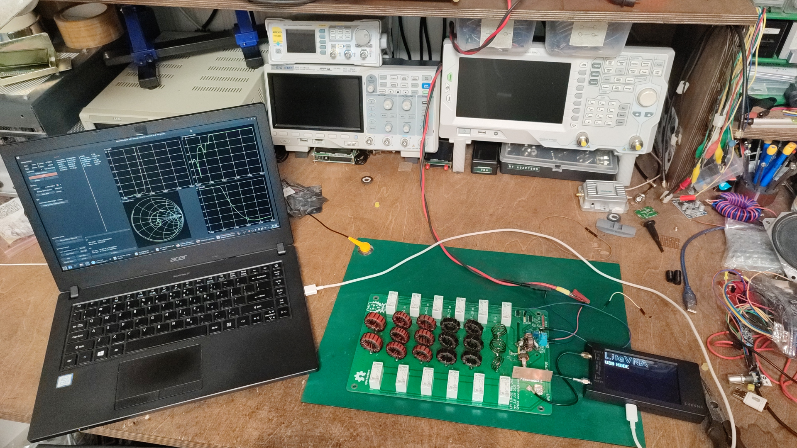
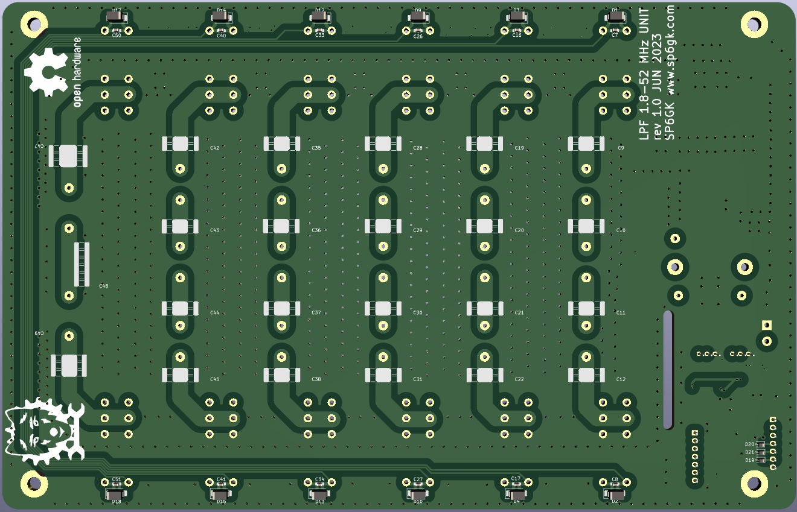

# LPF_Board_HF-6m_Forte600
Design of a LPF board with 6 filters covering entire HF spectrum and 6 m band. Suitable for 600 W (or more) LDMOS/BJT amplifiers.

## Overview

For a detailed theory of operation and a description of the design process, you can read section 2.2.3 of my thesis: [Optimization of HF Amplifier TLT Forte600 Documentation](https://github.com/SP6GK/Forte-600-HF-RF-Amplifier/blob/main/Optimization_HF_amplifier_TLT_Forte600Documentation.pdf).

This low pass filter board was designed for a 600 W amplifier and successfully withstood 600 W of CW power with no issues. It is overrated to handle about 1 kW, however, in such case, the size of some of the toroids should be increased.  
These filters used in the Forte 600 ([Forte 600 project repo](https://github.com/SP6GK/Forte-600-HF-RF-Amplifier)) provide a worst-case harmonic suppression of 54 dBc for the 15 m band. Check the `/Results` directory for S21 and S11 measurements, or refer to sections 4.7 and 4.8 of my thesis for a more in-depth discussion of the results: [Optimization of HF Amplifier TLT Forte600 Documentation](https://github.com/SP6GK/Forte-600-HF-RF-Amplifier/blob/main/Optimization_HF_amplifier_TLT_Forte600Documentation.pdf).  
During assembly use only high quality, high current capable, COG capacitors rated at 1 kV or more.

The board includes a tandem match coupler, allowing the forward and reflected power at the output to be measured. The desired LPF is selected either by applying a low level 5 V signal to connector J4, which requires 7 wires, or by driving a shift register (U2) directly from a microcontroller (3.3 V to 5 V) using only 3 wires.  
The code for band changing and shift register driving is available in my repository for the LDMOS amplifier controller: [Link](https://github.com/SP6GK/RF_Power_Amplifier_Controller_V1).  
To find out more about the Forte 600 project, you can visit my website: [www.sp6gk.com](https://www.sp6gk.com/).

## Directory Structure

- **/bom**  
  Contains an interactive HTML BOM for assembly and the `BOM_LC.ods` spreadsheet, which indicates the number of turns and suggested values for capacitors, ensuring that the combined capacitance value is achieved using at least 4 parallel capacitors.

- **/Gerbers**  
  Files for sending the project to your favorite PCB fabricator.

- **/KiCad**  
  Contains the PCB project files.

- **/PDF**  
  Contains 1:1 scale prints of the copper and silk screen layers.

- **/Results**  
  Contains S21 and S11 measurements of the assembled board. Measurements were made using a calibrated LiteVNA 64, and .s2p files were plotted in AWR Designer.

- **Coilformer1y.stl** & **Coilformer2.stl**  
  Temporary coil formers for the 6m band, which you can 3D print and then wind the coil on.

- **LPF.asc**  
  LTspice simulation of the LPF filters.

- **LPF+6m_Schematic.pdf**  
  schematic document.

- **LPF_live.mlx**  
  A MATLAB Live Script for the calculation of LC elements, formulas and values for polynomials were sourced from "Experimental Methods in RF Design" book.

